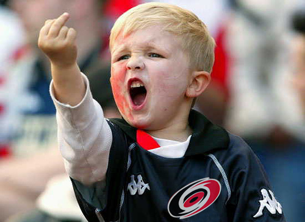

# 
 Инструкция для работы с Markdown

## Выделение текста

Чтобы выделить текст курсивом необходимо обрамить его звездочками (*) или знаком нижнего подчеркивания (_). Например: *Вот так.* или _Вот так_

Чтобы выделить текст полужирным, необходимо обромить его двойными звездочками (**) или двойным знаком нижнего подчеркивания (__). Например: **Вот так** или __Вот так__

Альтернативные способы выделения текста жирным или курсивом нужны для того что бы мы могли совмещать оба этих способа. Например: _Текст может быть выделен курсивом и при этом быть **полужирным**_

## Списки

Чтобы добавить ненумерованные списки, необходимо пункты выделить звездочкой (*) или знаком +. Например:

* Элемент 1
* Элемент 2
* Элемент 3
+ Элемент 4

Что бы добавить нумерованные списки, необходимо просто пронумеровать. Например:

1. Пункт
2. Пункт
3. Пункт

## Работа с изображениями

Что бы вставить изображение в текст, достаточно написать следующее: 

## Ссылки

## Работы с таблицами

## Цитаты 

## Заключение